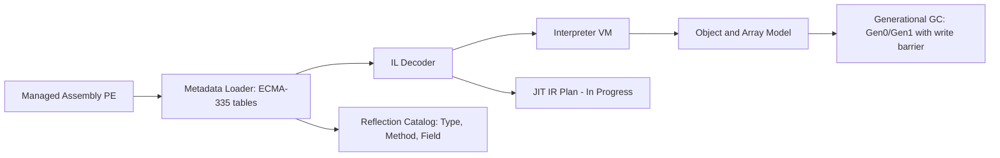

# DotForge

[](https://github.com/mozaika228/dotforge/actions/workflows/ci.yml)
[](https://codecov.io/gh/mozaika228/dotforge)
[](LICENSE)

DotForge is a CLR-style runtime project focused on executing managed IL with a production-oriented architecture: metadata loading, IL decoding, interpreter execution, and generational GC foundations.

## Architecture Overview



## Features

- ECMA-335 metadata loading (`TypeDef`, `MethodDef`, `FieldDef`, member refs).
- IL decoding for core control-flow and object ops:
  - args/locals (`ldarg*`, `ldloc*`, `stloc*`)
  - constants and strings (`ldc.i4*`, `ldstr`, `ldnull`)
  - math/comparisons (`add`, `sub`, `mul`, `div`, `ceq`, `cgt`, `clt`)
  - branching (`br*`, `brtrue*`, `brfalse*`, `leave*`)
  - object/field (`newobj`, `ldfld`, `stfld`)
  - arrays (`newarr`, `ldlen`, `ldelem.i4`, `stelem.i4`, `ldelem.ref`, `stelem.ref`)
  - boxing (`box`, `unbox`, `unbox.any`)
  - calls (`call`, `callvirt`, `calli` baseline for `ldftn` function pointers)
  - exceptions (`throw`, catch-region handling baseline)
- Inline cache for `callvirt` dispatch (`method token + runtime type`).
- Runtime object model for `int32`, `string`, object instances, and arrays.
- Full GC runtime model (current implementation scope):
- Gen0 + Gen1 + LOH partitions with automatic collection thresholds
- mark/sweep with compaction phase simulation for stable survivor sets
- write barrier + remembered set for old-to-young references
- strong/weak handle table and finalization queue callbacks
- collection statistics and logging (`DOTFORGE_GC_LOG=1`)
- Metadata reflection catalog for type/method/field inspection.
- Runtime type system layer with generic arity and generic instantiation model.
- Runtime services facade (`RuntimeHost`) for managed execution, reflection queries, JIT plan access, and GC snapshots.
- Multithreaded runtime host execution (`RunEntryPointParallelAsync`) with isolated VM instances and aggregated run metrics.
- Interop baseline:
- P/Invoke dispatch for `DllImport` methods (`PinvokeImpl` metadata).
- Built-in native shim module `dotforge_native` (`abs`, `strlen`, `toupper_first`).
- Loader and verification:
- Assembly load context with probing-based reference resolution.
- Metadata validation and IL verification (`dotforge verify`).
- JIT planning scaffold (`IL -> IR`) to support native backend work.
- RyuJIT-lite foundation:
- three-address IR (`IlToIrLowerer`)
- optimization passes (`const-fold`, `dce`)
- pseudo x64 lowering for diagnostics

## CLI

- `dotforge run <assembly>`: execute assembly entry point (`Main`).
  - optional flags: `--verify`, `--strict-warnings`
- `dotforge inspect <assembly>`: dump metadata types/methods/fields.
- `dotforge disasm <assembly> <method-token-or-Type::Method>`: dump decoded IL.
- `dotforge verify <assembly>`: run metadata + IL verification and reference resolution checks.
- `dotforge runtime <assembly> [parallel-runs]`: execute and print runtime snapshot (`types/methods/jit/gc/runs`).

Examples:

```bash
dotforge run ./samples/Hello.dll
dotforge run ./samples/Hello.dll --verify
dotforge inspect ./samples/Hello.dll
dotforge disasm ./samples/Hello.dll Program::Main
dotforge runtime ./samples/Hello.dll
dotforge runtime ./samples/Hello.dll 8
```

## Build & Run

```bash
dotnet restore dotforge.sln --use-lock-file
dotnet build dotforge.sln -c Release
dotnet format dotforge.sln --verify-no-changes --no-restore
dotnet test dotforge.sln -c Release
```

## Toolchain & DX

- SDK pinning via `global.json` (`.NET 8` feature band with roll-forward).
- Shared compiler/build defaults in `Directory.Build.props`.
- NuGet lock-file generation enabled via `RestorePackagesWithLockFile`.
- Repository code style via `.editorconfig`.
- Dev scripts:
  - PowerShell: `./scripts/dev.ps1 <bootstrap|restore|build|test|format|ci>`
  - Bash: `./scripts/dev.sh <bootstrap|restore|build|test|format|ci>`
- Production release gate: [`Definition of Done`](docs/DEFINITION_OF_DONE.md)

## Repository Structure

- `src/Dotforge.Metadata`: PE/metadata reader + reflection catalog.
- `src/Dotforge.IL`: IL opcode model and decoder.
- `src/Dotforge.Runtime`: VM, object model, arrays, GC foundation, JIT IR scaffold.
- `src/Dotforge.Cli`: `run`, `inspect`, `disasm` commands.
- `tests/Dotforge.Runtime.Tests`: xUnit integration and opcode coverage tests.
- `.github/workflows/ci.yml`: CI restore/build/test + coverage artifact upload.

## Roadmap

- JIT backend: SSA/IR lowering -> native codegen (LLVM/C++ backend).
- Full reflection: richer signatures, generics, attributes, runtime handles.
- Exception handling: complete `try/catch/finally`, filter semantics, unwind fidelity.
- EH/unwinding core path now executes `finally/fault` during `leave` and exception propagation.
- AOT pipeline for ahead-of-time compilation and startup optimization.
